# The Rabin-Karp Algorithm (hashing): a step-by-step walkthrough

[](https://github.com/MarynaShavlak/algo-rabin-karp-string-search)

[🇺🇦 Українська](README.md)  ·  **🇬🇧 English**

**The Rabin-Karp algorithm** searches for a substring (pattern) inside a text **using hashing**. It solves the same problem as the earlier algorithms of the series ([naive](https://github.com/MarynaShavlak/algo-naive-string-search), [KMP](https://github.com/MarynaShavlak/algo-knuth-morris-pratt-search), [Boyer-Moore](https://github.com/MarynaShavlak/algo-boyer-moore-string-search)): find the position at which the **pattern** occurs in the **main string** (text). But it does so in a **fundamentally different** way.

The naive method, KMP and Boyer-Moore compare **characters**. Rabin-Karp compares **numbers**: it turns a string into a **hash** and at every alignment compares the **window's hash** with the **pattern's hash**. Comparing two integers is cheap; a **character-by-character** check is done **only when the hashes match** — because different strings can share the same hash (a **collision**). The algorithm is especially effective when there are many possible occurrences.

The core idea is the **windowing approach**: a window the size of the pattern slides along the text. Two new heroes of this walkthrough:

1. **Polynomial hash** — a string becomes a number: $h(s) = \sum_{i=0}^{n-1} s[i]\cdot b^{\,n-i-1} \bmod m$.
2. **Rolling hash** — the next window's hash is recomputed in $O(1)$: subtract the contribution of the old (left) character, multiply by the base, add the new (right) one — instead of recomputing from scratch in $O(m)$.

This repository is educational material: a clean implementation of the algorithm (verbatim from the synopsis) + detailed visualizations of every step. The entire walkthrough below is reproduced by the code in [`examples/`](examples), and the figures live in [`docs/images/`](docs/images).

---

## Contents

- [Repository structure](#repo-structure)
- [Quick start](#quickstart)
- **Theory**
  - [Intuition: why a hash instead of characters](#intuition)
  - [The two phases of Rabin-Karp](#two-phases)
- **Phase 1 — polynomial hash (string → number)**
  - [The formula and the `polynomial_hash` code](#hash-code)
  - [Signature example: `abc` → 6382179 → 90](#hash-abc)
  - [More hashes: `developer` → 35, `general` → 82](#hash-more)
- **Phase 2 — search**
  - [The `rabin_karp_search` code (from the synopsis)](#search-code)
  - [The synopsis example: searching for «developer» → 8](#search-konspekt)
  - [Rolling hash: an `O(1)` update](#rolling)
- **Collisions — the unique gem**
  - [Different strings, the same hash](#collisions)
  - [A collision during the search: why the char check is needed](#collision-search)
  - [Modular arithmetic: why a modulus and a prime](#modular)
- **Complexity**
  - [`O(n+m)` on average vs `O(n·m)` in the worst case](#complexity)
- [Stepping through the code: «code ↔ data» panels](#code-walkthrough)
- [Full step-by-step trace of the synopsis example](#full-walkthrough)
- **Summary**
  - [Properties and edge cases](#properties)
  - [Four string algorithms: the summary table](#series)
  - [Summary](#summary)
- [License](#license)

---

<a id="repo-structure"></a>

## Repository structure

The directory tree and the split of responsibilities between modules are in a separate file — **[PROJECT_STRUCTURE.en.md](PROJECT_STRUCTURE.en.md)**.

---

<a id="quickstart"></a>

## Quick start

Installation commands, how to run the examples and the tests, and a minimal library-usage example are in **[USAGE.en.md](USAGE.en.md)**.

---

<a id="intuition"></a>

## Intuition: why a hash instead of characters

Suppose we are searching for a pattern in a long text. The naive method, at every alignment, compares characters **one by one**. Rabin-Karp does it differently: it compresses the pattern into a single **number** — its **hash** — and computes the hash of every text window the same way. Then, instead of comparing strings character by character, it compares **two integers** — a single cheap operation.


Of course, a hash "loses information": different strings may produce the same hash. So when the **hashes match** the algorithm performs an **extra character check** — to confirm it found exactly the pattern and not a random string with the same hash. If the hashes **differ**, the strings are definitely different — and the window simply slides on.

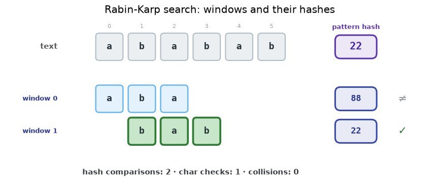

To compute each window's hash quickly, Rabin-Karp uses a **rolling hash**: the new hash is derived from the old one in $O(1)$, without recomputing from scratch. This is exactly what makes the algorithm efficient.

<a id="two-phases"></a>

## The two phases of Rabin-Karp

| Phase | What it does | Complexity |
|---|---|---|
| **1. Hashing** | `polynomial_hash(s)` turns a string into a number | $O(m)$ per pattern, $O(1)$ per new window (rolling) |
| **2. Search** | `rabin_karp_search(text, pattern)` slides the window, compares hashes, and verifies characters on a hash match | $O(n+m)$ on average |

Below we examine each phase separately.

---

<a id="hash-code"></a>

## Phase 1 — polynomial hash (string → number)

Polynomial hashing treats each character of a string as a **polynomial coefficient** with base $b$ (usually a prime; here 256 — because of the size of the ASCII table). The general formula for a string $s$ of length $n$:

$$h(s) = \sum_{i=0}^{n-1} s[i]\cdot b^{\,n-i-1} \bmod m,$$

where $s[i]$ is the numeric code of the character (`ord`), $b$ is the base, and $m$ is the modulus (here the prime 101). Here is the implementation from the synopsis — the one we walk through line by line (the fully documented version is in [`rabin_karp_string_search/core.py`](rabin_karp_string_search/core.py)):

```python
def polynomial_hash(s, base=256, modulus=101):
    n = len(s)
    hash_value = 0
    for i, char in enumerate(s):
        power_of_base = pow(base, n - i - 1) % modulus
        hash_value = (hash_value + ord(char) * power_of_base) % modulus
    return hash_value
```

Here `pow(base, n - i - 1) % modulus` is the base raised to the power `n-i-1` modulo `modulus`. The modulus ensures the hash always stays below a given number, **preventing overflow** (more on this below).

<a id="hash-abc"></a>

### Signature example: `abc` → 6382179 → 90

Take the string `"abc"` and base `256`. First **without the modulus**:

$$h = \text{ord}(\texttt{a})\cdot 256^2 + \text{ord}(\texttt{b})\cdot 256^1 + \text{ord}(\texttt{c})\cdot 256^0 = 6356992 + 25088 + 99 = 6382179.$$

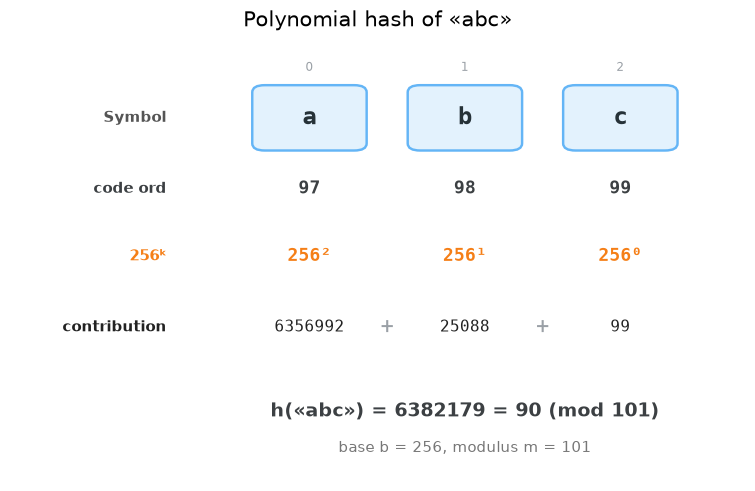

The number `6382179` is already sizable — and on long strings it grows exponentially and overflows any type. So we take it **modulo 101**:

$$6382179 \bmod 101 = 90.$$

The hashes are printed by [`examples/01_polynomial_hash.py`](examples/01_polynomial_hash.py) — exactly as in the synopsis:

```text
polynomial_hash("abc") = 90
polynomial_hash("developer") = 35
polynomial_hash("general") = 82
```

<a id="hash-more"></a>

### More hashes: `developer` → 35, `general` → 82

In practice `polynomial_hash` does not collapse the whole polynomial into one large number; instead it **accumulates** the hash step by step modulo `m` (Horner's scheme) — so the intermediate values always stay small. Here is the full step-by-step accumulation for the pattern `"developer"`:

```text
Step-by-step Horner accumulation for «developer»:
  i=0: + ord(«d»)·79 → hash = 22
  i=1: + ord(«e»)·37 → hash = 22
  i=2: + ord(«v»)·25 → hash = 43
  i=3: + ord(«e»)·36 → hash = 43
  i=4: + ord(«l»)·68 → hash = 14
  i=5: + ord(«o»)·5 → hash = 64
  i=6: + ord(«p»)·88 → hash = 22
  i=7: + ord(«e»)·54 → hash = 22
  i=8: + ord(«r»)·1 → hash = 35
```

> A fun coincidence: `ord("e") = 101` — exactly the modulus, so **every** «e» adds `101·… mod 101 = 0` and leaves the hash unchanged (steps `i=1, 3, 7`). It vividly shows that a single character can contribute zero modulo `m`.

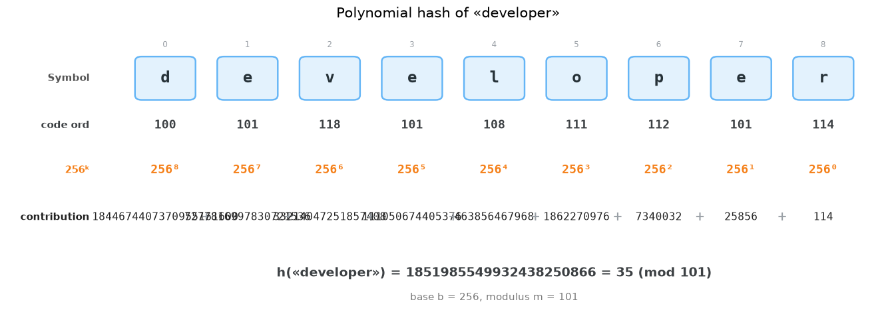

▶️ Building the hash in motion (Horner accumulation):

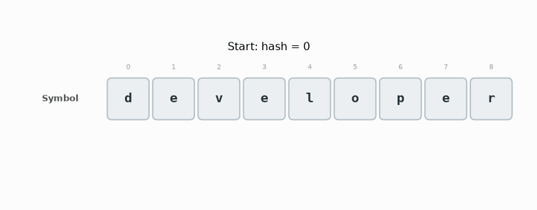

🎬 *MP4 version:* [`hash_build.mp4`](docs/images/en/hash_build.mp4)

---

<a id="search-code"></a>

## Phase 2 — search

### The `rabin_karp_search` code (from the synopsis)

```python
def rabin_karp_search(main_string, substring):
    # Lengths of the main string and the search substring
    substring_length = len(substring)
    main_string_length = len(main_string)
    # The base for hashing and the modulus
    base = 256
    modulus = 101
    # Hash values for the search substring and the current slice in the main string
    substring_hash = polynomial_hash(substring, base, modulus)
    current_slice_hash = polynomial_hash(main_string[:substring_length], base, modulus)
    # Precomputed value for recomputing the hash
    h_multiplier = pow(base, substring_length - 1) % modulus
    # Walk through the main string
    for i in range(main_string_length - substring_length + 1):
        if substring_hash == current_slice_hash:
            if main_string[i:i+substring_length] == substring:
                return i
        if i < main_string_length - substring_length:
            current_slice_hash = (current_slice_hash - ord(main_string[i]) * h_multiplier) % modulus
            current_slice_hash = (current_slice_hash * base + ord(main_string[i + substring_length])) % modulus
            if current_slice_hash < 0:
                current_slice_hash += modulus
    return -1
```

The search logic (from the synopsis):

1. Compute the hash of the **pattern** (`substring_hash`) and the hash of the **first window** of the text (`current_slice_hash`).
2. Compare the window's and the pattern's hashes:
   - if they **match** → perform an **extra character check** (`main_string[i:i+m] == substring`); if it passes — return the position `i`;
   - if they **differ** → simply shift the window by 1.
3. While shifting the window, **recompute the hash** by subtracting the old (left) character and adding the new (right) one — this is the rolling hash, instead of recomputing from scratch.
4. If no window yields a confirmed match — return `-1`.

<a id="search-konspekt"></a>

### The synopsis example: searching for «developer» → 8

Let us reproduce the main example of the synopsis. The driver, verbatim:

```python
main_string = "Being a developer is not easy"
substring = "developer"
position = rabin_karp_search(main_string, substring)
if position != -1:
    print(f"Substring found at index {position}")
else:
    print("Substring not found")
```

It prints exactly:

```text
Substring found at index 8
```

The substring «developer» begins at position 8. The pattern's hash is `35`. Here is the full search trace (one window per row) — printed by [`examples/02_search.py`](examples/02_search.py):

```text
  i  | window | window hash | pattern hash | verdict
  --------------------------------------------------
   0 | Being␣a␣d |    37     |     35      | hashes differ
   1 | eing␣a␣de |    10     |     35      | hashes differ
   2 | ing␣a␣dev |    52     |     35      | hashes differ
   3 | ng␣a␣deve |    86     |     35      | hashes differ
   4 | g␣a␣devel |    92     |     35      | hashes differ
   5 | ␣a␣develo |    82     |     35      | hashes differ
   6 | a␣develop |    35     |     35      | collision (char check rejects)
   7 | ␣develope |    67     |     35      | hashes differ
   8 | developer |    35     |     35      | real match
```

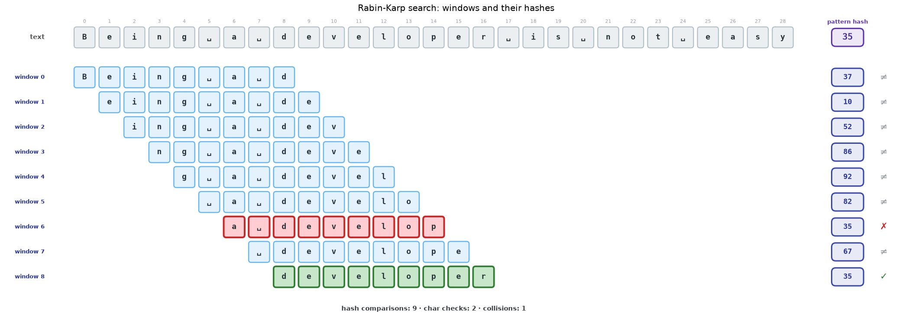

Note **offset 6**: the window `"a develop"` has hash `35` — **the same** as the pattern! But the character check shows that `"a develop" ≠ "developer"` — this is a **collision**, and the algorithm slides on. The real match comes only at offset 8. In total: 9 hash comparisons, yet only **2** character checks (one of which is a collision).

▶️ The synopsis search in motion (the window slides, the hash "rolls"):

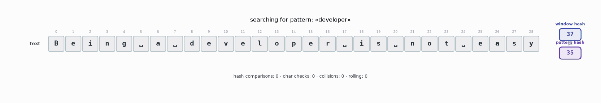

🎬 *MP4 version:* [`search_konspekt.mp4`](docs/images/en/search_konspekt.mp4)

If the pattern is absent, the driver prints `Substring not found` (and the function returns `-1`).

<a id="rolling"></a>

### Rolling hash: an `O(1)` update

The most expensive part of windowed search is computing each window's hash. Doing it **from scratch** (`polynomial_hash` of the whole window) costs $O(m)$ per step and $O(n\cdot m)$ overall. The **rolling hash** turns the recomputation into $O(1)$: when the window shifts by 1, the left character **leaves** and the right one **enters** — so:

```python
current_slice_hash = (current_slice_hash - ord(main_string[i]) * h_multiplier) % modulus
current_slice_hash = (current_slice_hash * base + ord(main_string[i + substring_length])) % modulus
if current_slice_hash < 0:
    current_slice_hash += modulus
```

Here `h_multiplier = pow(base, m-1) % modulus` is the **weight** of the leftmost character (the base to the power `m-1`) that must be subtracted. The last two lines fix a possible **negative** intermediate value (from `%` of a difference).

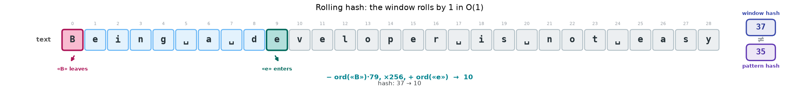

The payoff is immediate. How many "character operations" does hashing all windows cost (printed by [`examples/03_rolling_collisions.py`](examples/03_rolling_collisions.py)):

```text
Rolling hash: O(1) update vs recompute-from-scratch O(m)
  n= 8: rolling 12 character operations, recompute 20
  n=16: rolling 28 character operations, recompute 52
  n=32: rolling 60 character operations, recompute 116
  n=64: rolling 124 character operations, recompute 244
```

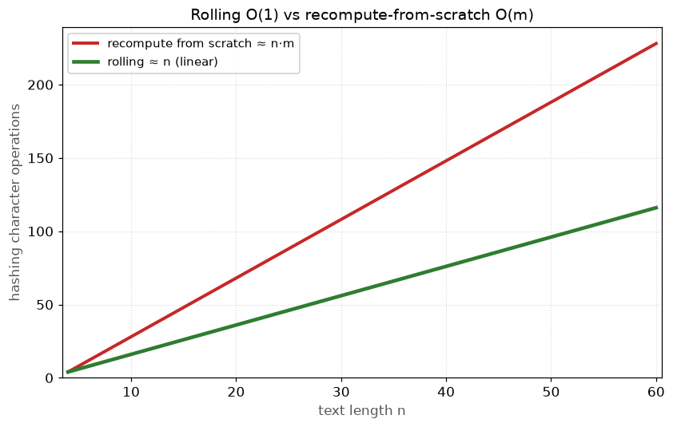

The text block above is a concrete short pattern `"abcd"` (rolling is ~2× cheaper). In the graph the pattern **grows with the text** (`m ≈ n/2`), so recomputing from scratch becomes a **quadratic** curve (red) `≈ n·m` that pulls away from the **linear** rolling one (green) `≈ n` without bound.

---

<a id="collisions"></a>

## Collisions — the unique gem

In our code we take a substring and convert it into a numeric value — a hash. **If two strings are equal, their hashes are equal too — always.** The converse, however, is not always true: **two different strings may have the same hash**, and this phenomenon is called a **collision**. That is exactly why we perform an extra character-by-character comparison for confirmation.

### Different strings, the same hash

The parameters here are fixed at `(base=256, modulus=101)`, so a concrete collision can be found by **scanning** the space of strings. Here is a classic pair — the words `"for"` and `"jar"` have the **same** hash `35`, although they are different strings:

```text
Collisions under (base=256, modulus=101): different strings, same hash
  «for» and «jar»: hash = 35 (yet the strings differ!)
  «heap» and «user»: hash = 12 (yet the strings differ!)
```

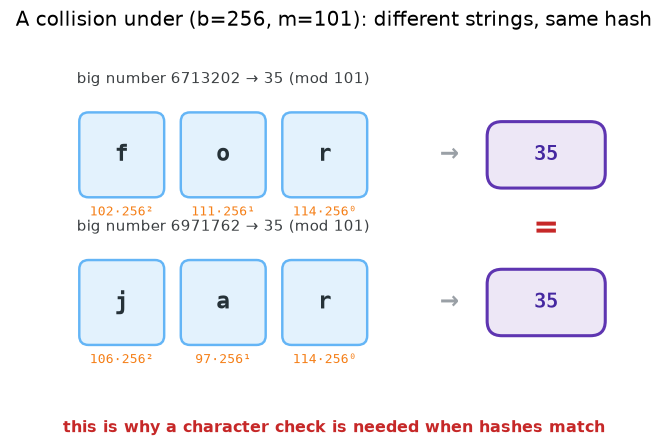

Their "big numbers" without the modulus are **different** (`6713202` vs `6971762`), yet modulo 101 both yield `35`. It is exactly modular arithmetic that "glues" different numbers into one hash — and creates collisions.

<a id="collision-search"></a>

### A collision during the search: why the char check is needed

Now the most important part — a **collision during the search itself**. Let us search for `"jar"` in the text `"for a jar of jam"`. The very first window — `"for"` — has hash `35`, **exactly like the pattern `"jar"`**! Without the character check the algorithm would declare a false match. But the check `"for" == "jar"` fails — this is a collision, so the search continues; the real `"jar"` is at offset 6:

```text
Searching for «jar» in «for a jar of jam»:
  hash comparisons 7, char checks 2, collisions among them 1, match at 6
```

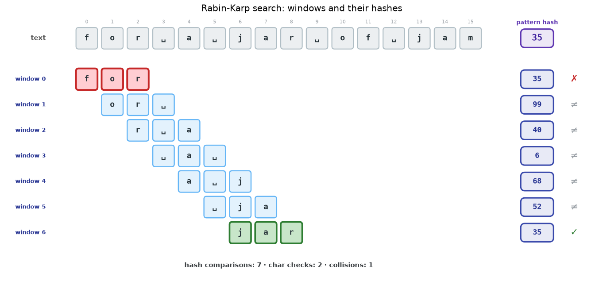

The red window (offset 0) is a **collision**: the hash matched, but the char check rejected it. The green one (offset 6) is the real match. **This is why a character check is needed when hashes match.**

▶️ A collision during the search, in motion:

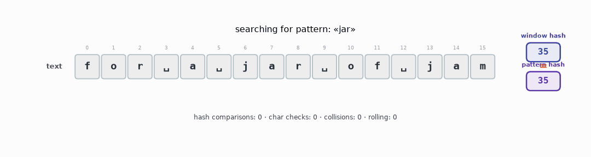

🎬 *MP4 version:* [`search_collision.mp4`](docs/images/en/search_collision.mp4)

<a id="modular"></a>

### Modular arithmetic: why a modulus and a prime

**Why a modulus.** Without it the hash grows exponentially: `"developer"` alone gives a 22-digit number, and on long strings — overflow. The modulus keeps the hash in the range `[0, m)`.

**Why a prime.** A prime modulus (here 101) distributes hashes **more uniformly**, so collisions are rarer. The trade-off is direct: **a small or bad modulus → more collisions → slower**. With the worst modulus `1`, **all** hashes become `0`, every window "matches" by hash, and the character check fires **every time** — Rabin-Karp degenerates into the naive method:

```text
Modular arithmetic: why a modulus and why a prime
  without the modulus the hash of «developer» = 1851985549932438250866 (≈ 22 digits) — overflow
  «aaaaaaaaaaaaaaaa» / «aaaaaaab»:
    modulus 101 (prime): collisions 0, char comparisons 0 — RK is fast
    modulus 1 (worst): collisions 9, char comparisons 72 — RK = naive
```

---

<a id="complexity"></a>

## Complexity: `O(n+m)` on average vs `O(n·m)` in the worst case

The Rabin-Karp algorithm has the following asymptotic complexity:

| Case | Time | When |
|---|---|---|
| **average / best** | $O(n + m)$ | the hash function distributes uniformly, collisions are rare — in practice close to linear |
| **worst** | $O(n \cdot m)$ | many hash collisions → many direct substring comparisons (in particular with a bad/small modulus) |

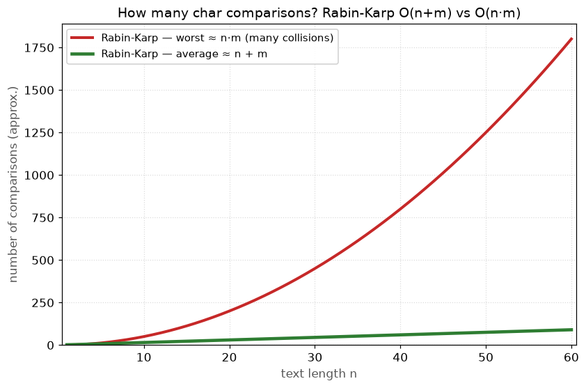

The advantage of Rabin-Karp is its efficiency for real-world conditions when matches are few; and it is also **great for many occurrences** (hash comparisons stay cheap). It becomes slower when hashes match often but substrings do not (because of the extra comparisons).

---

<a id="code-walkthrough"></a>

## Stepping through the code: «code ↔ data» panels

The examples above showed the *result* of each step. Here is **the code itself in action**: on the left, a fragment of the algorithm with the **active lines highlighted**; on the right, the data at that very moment. **The line color encodes the branch:** 🟡 active line, 🟠 hash match (candidate), 🟢 confirmed / found, 🔴 collision / not found, 🔵 rolling update. Two functions — two panels; generated by [`examples/05_code_walkthrough.py`](examples/05_code_walkthrough.py).

**Hashing — `polynomial_hash` for `"abc"`** (on the right — characters and the accumulated hash):

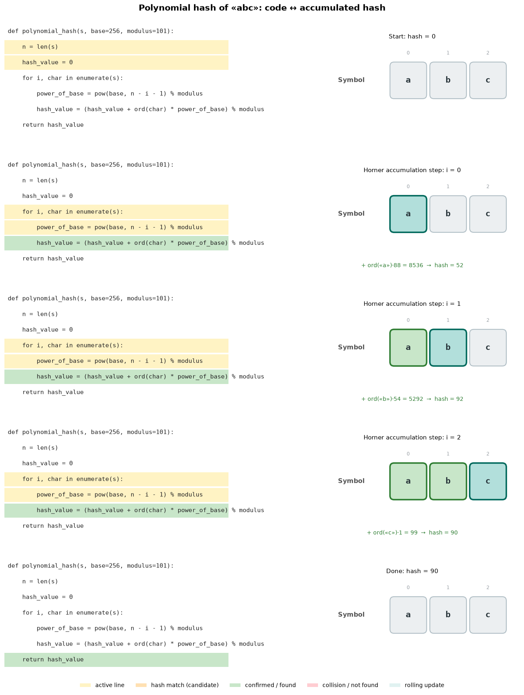

▶️ [Hashing animation](docs/images/en/code_hash_walk.gif) · 🎬 [`code_hash_walk.mp4`](docs/images/en/code_hash_walk.mp4)

**Search — `rabin_karp_search` for `"jar"` in `"for jar"`** (on the right — the sliding window with its hash badge; at offset 0 — a collision):

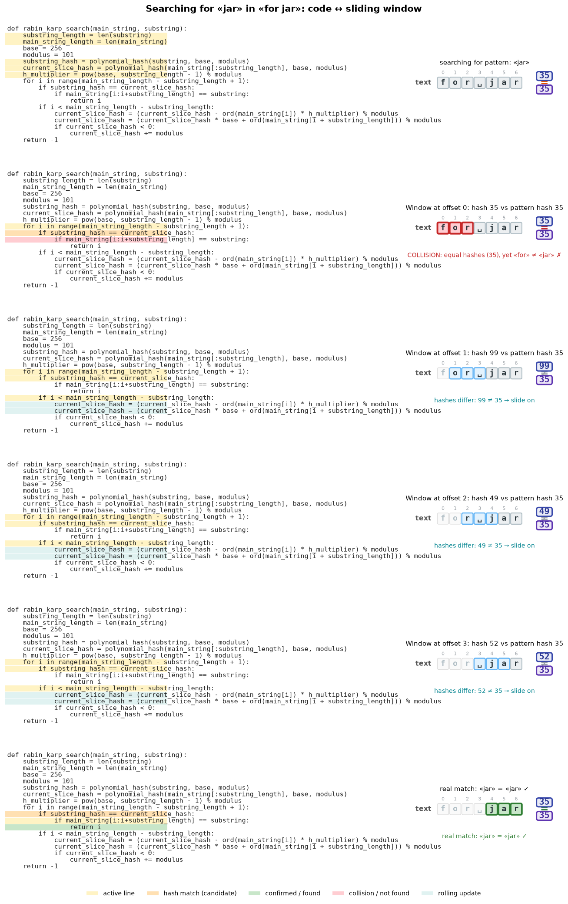

▶️ [Search animation](docs/images/en/code_search_walk.gif) · 🎬 [`code_search_walk.mp4`](docs/images/en/code_search_walk.mp4)

---

<a id="full-walkthrough"></a>

## Full step-by-step trace of the synopsis example

Below is the same execution, but **in full** and in two phases: first the computation of the hash of the pattern «developer», then the search itself in the synopsis text. Each step is a separate «code ↔ data» frame with a detailed explanation beneath it. The colors are the same as in the [legend above](#code-walkthrough). The block is generated automatically from the event logs (the example [`examples/06_full_walkthrough.py`](examples/06_full_walkthrough.py)).

<!-- WALKTHROUGH:START -->

### Phase 1 — hashing: the polynomial hash of pattern «developer»

#### Step H00

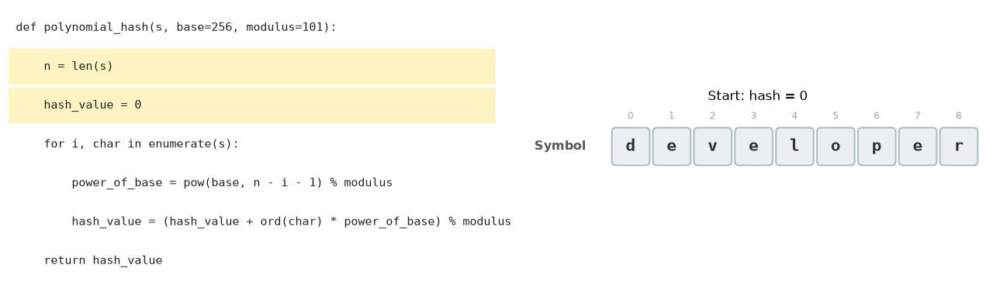

Phase 1 — **hashing**. We turn the pattern «developer» (length 9) into a number — its polynomial hash modulo 101. We start from `hash = 0` and add each character's contribution left to right (Horner's scheme).

#### Step H01

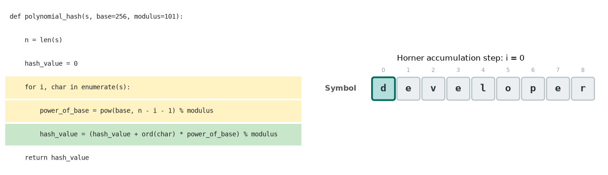

Step `i = 0`: character «d» (code `ord = 100`). Power `pow(256, 8) % 101 = 79`, contribution `100·79 = 7900`. Accumulated `hash = 22`.

#### Step H02

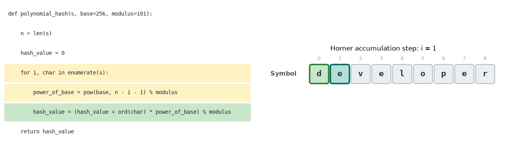

Step `i = 1`: character «e» (code `ord = 101`). Power `pow(256, 7) % 101 = 37`, contribution `101·37 = 3737`. Accumulated `hash = 22`.

#### Step H03

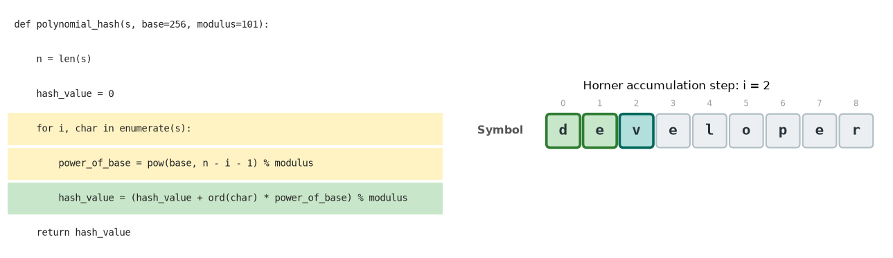

Step `i = 2`: character «v» (code `ord = 118`). Power `pow(256, 6) % 101 = 25`, contribution `118·25 = 2950`. Accumulated `hash = 43`.

#### Step H04

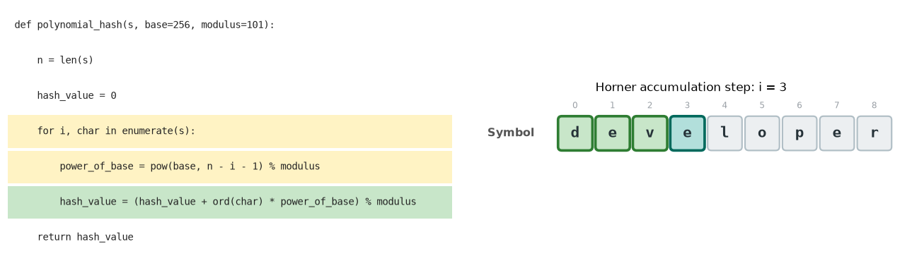

Step `i = 3`: character «e» (code `ord = 101`). Power `pow(256, 5) % 101 = 36`, contribution `101·36 = 3636`. Accumulated `hash = 43`.

#### Step H05

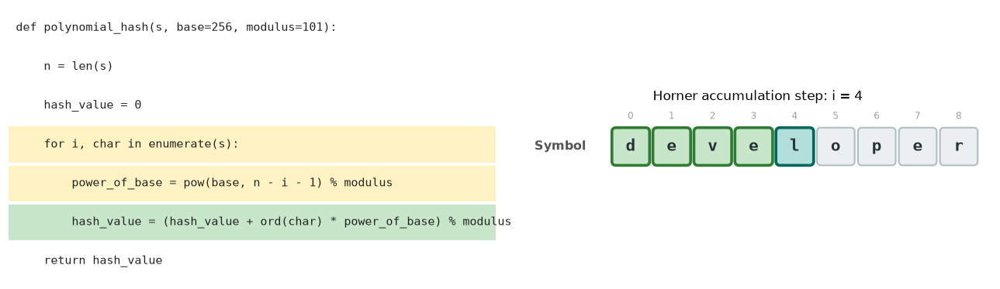

Step `i = 4`: character «l» (code `ord = 108`). Power `pow(256, 4) % 101 = 68`, contribution `108·68 = 7344`. Accumulated `hash = 14`.

#### Step H06

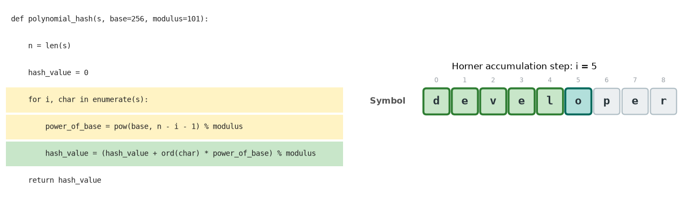

Step `i = 5`: character «o» (code `ord = 111`). Power `pow(256, 3) % 101 = 5`, contribution `111·5 = 555`. Accumulated `hash = 64`.

#### Step H07

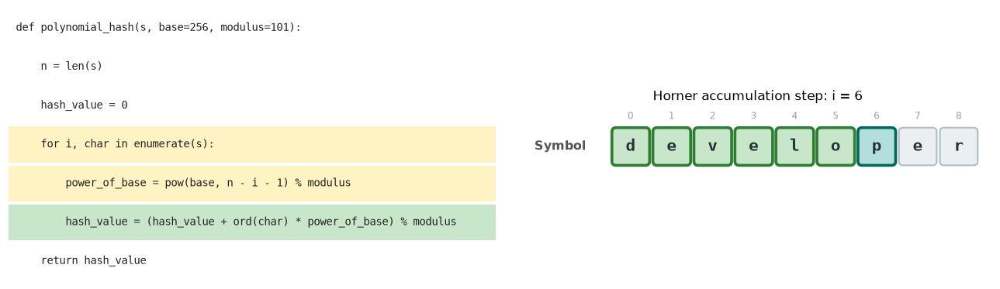

Step `i = 6`: character «p» (code `ord = 112`). Power `pow(256, 2) % 101 = 88`, contribution `112·88 = 9856`. Accumulated `hash = 22`.

#### Step H08

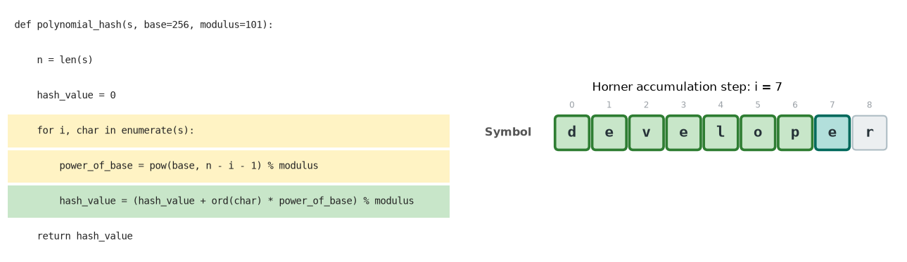

Step `i = 7`: character «e» (code `ord = 101`). Power `pow(256, 1) % 101 = 54`, contribution `101·54 = 5454`. Accumulated `hash = 22`.

#### Step H09

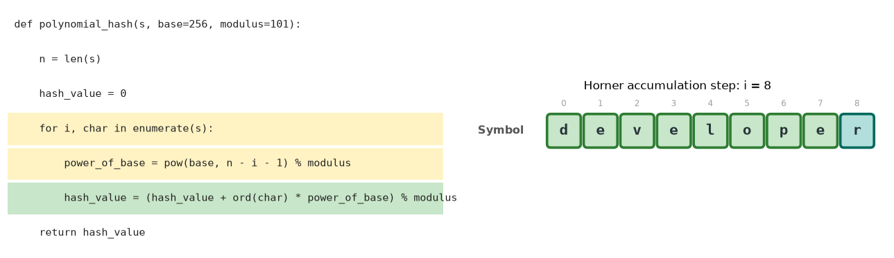

Step `i = 8`: character «r» (code `ord = 114`). Power `pow(256, 0) % 101 = 1`, contribution `114·1 = 114`. Accumulated `hash = 35`.

#### Step H10

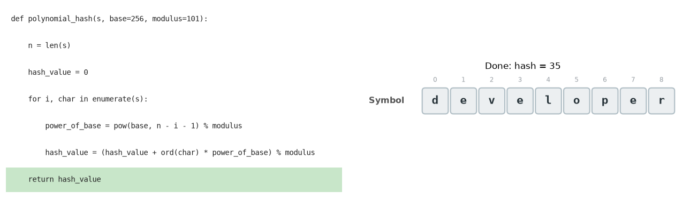

The hash of pattern «developer» is computed: **35**. This is the number we will compare against every window's hash — instead of comparing characters.

### Phase 2 — searching for «developer» in the konspekt text

#### Step S00

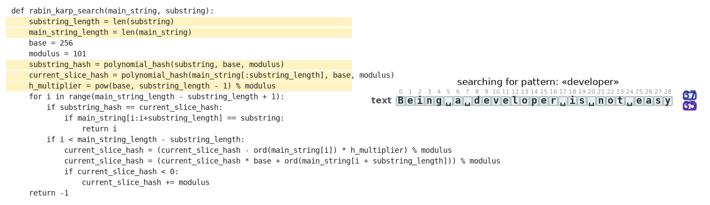

Phase 2 — **search**. The hash of pattern «developer» equals **35**. A window of length 9 slides along the text; at each offset we compare the **window's hash** with 35. We check characters only when the hashes match.

#### Step S01

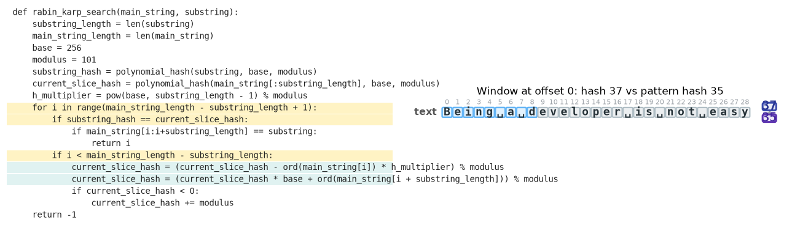

The window at offset `i = 0` is «Being␣a␣d», its hash **37** ≠ 35. No match, so we slide on. The next hash is computed in `O(1)` (rolling): the left character leaves, the right one enters.

#### Step S02


The window at offset `i = 1` is «eing␣a␣de», its hash **10** ≠ 35. No match, so we slide on. The next hash is computed in `O(1)` (rolling): the left character leaves, the right one enters.

#### Step S03

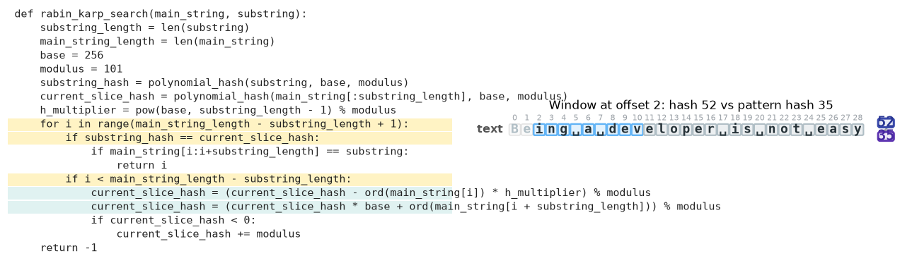

The window at offset `i = 2` is «ing␣a␣dev», its hash **52** ≠ 35. No match, so we slide on. The next hash is computed in `O(1)` (rolling): the left character leaves, the right one enters.

#### Step S04

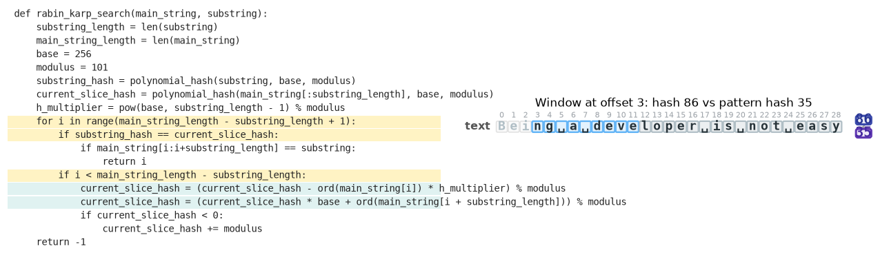

The window at offset `i = 3` is «ng␣a␣deve», its hash **86** ≠ 35. No match, so we slide on. The next hash is computed in `O(1)` (rolling): the left character leaves, the right one enters.

#### Step S05

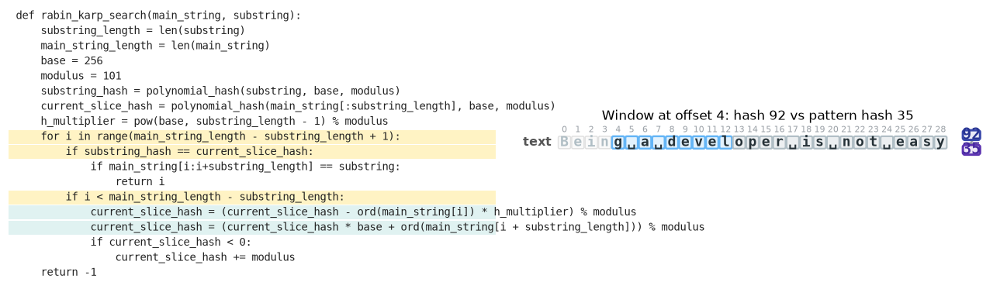

The window at offset `i = 4` is «g␣a␣devel», its hash **92** ≠ 35. No match, so we slide on. The next hash is computed in `O(1)` (rolling): the left character leaves, the right one enters.

#### Step S06

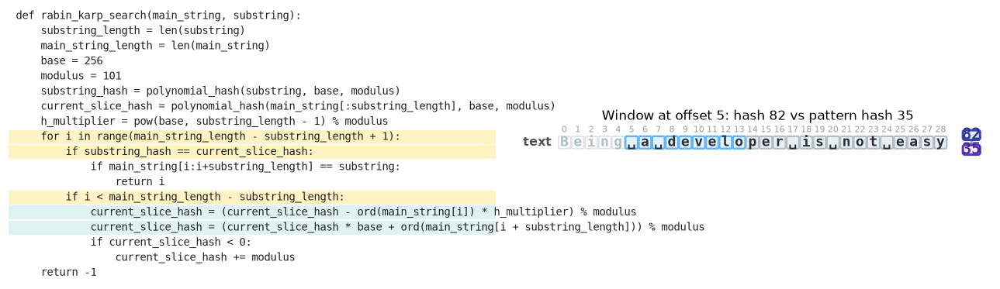

The window at offset `i = 5` is «␣a␣develo», its hash **82** ≠ 35. No match, so we slide on. The next hash is computed in `O(1)` (rolling): the left character leaves, the right one enters.

#### Step S07

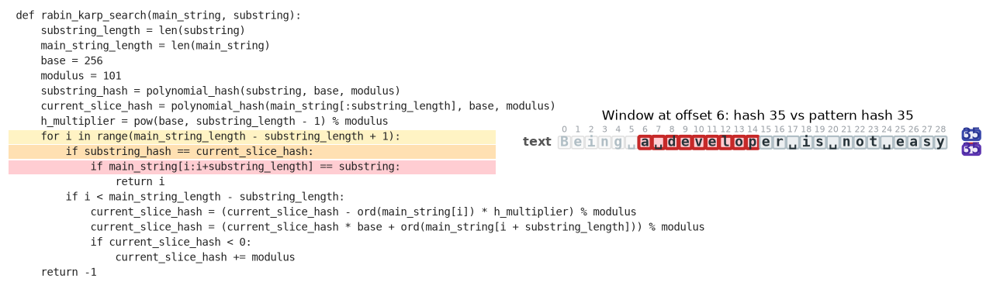

The window `i = 6` is «a␣develop», hash **35 = 35** — a HASH match! But the character check: «a␣develop» ≠ «developer». This is a **COLLISION** — different strings with the same hash. This is exactly where the character check saves us from a false match: we reject it and slide on.

#### Step S08

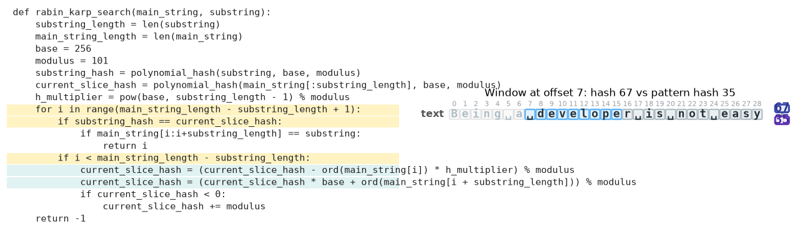

The window at offset `i = 7` is «␣develope», its hash **67** ≠ 35. No match, so we slide on. The next hash is computed in `O(1)` (rolling): the left character leaves, the right one enters.

#### Step S09

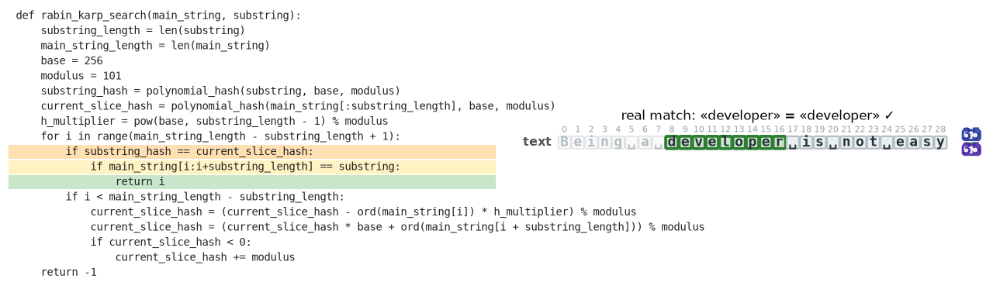

The window `i = 8` is «developer», hash **35 = 35**, and the check: «developer» = «developer» ✓ — a **real match**! We return position 8. Summary: 9 hash comparisons, only 2 character checks (of which 1 a collision), 8 rolling updates.

<!-- WALKTHROUGH:END -->

---

<a id="properties"></a>

## Properties and edge cases

- **Complexity:** $O(n+m)$ on average, $O(n\cdot m)$ in the worst case (many collisions); $O(1)$ extra memory (just a few variables for the hashes).
- **A hash instead of characters:** the algorithm compares **numbers**; the character check only **confirms** a hash match. This reduces comparing strings to comparing integers.
- **Great for many occurrences:** `rabin_karp_search_all` finds all positions in a single pass, keeping hash comparisons cheap.

Edge cases (covered in [`tests/`](tests)):

| Case | Behavior |
|---|---|
| pattern **equals** the text | position `0` |
| pattern **longer** than the text | `-1` (the window range is empty; the first slice's hash is still computed without crashing) |
| **single-character** pattern | ordinary search |
| **empty** pattern | `pow(base, -1)` would yield a **float** (a gotcha of the verbatim code); the safe behavior (`0`) is given by `rabin_karp_search_all` and `rabin_karp_search_steps` |
| **collision** | hash matched, strings differ → the character check **rejects** the false match (this very invariant is a dedicated test) |
| **multiple** occurrences | `rabin_karp_search` returns the first; `rabin_karp_search_all` returns all |

> **A critical invariant (test):** the rolling hash of each window **equals** the `polynomial_hash` of that window computed from scratch. That is, the $O(1)$ update produces exactly the same result as a full recomputation — only faster.

<a id="series"></a>

## Four string algorithms: the summary table

Rabin-Karp is the **fourth and final** string algorithm of the series, its **capstone**. Let us bring all four approaches together. Each verifies the substring against the text, but does it in its own way:

| Algorithm | Time (worst) | Preprocessing | Core idea |
|---|---|---|---|
| [**Naive**](https://github.com/MarynaShavlak/algo-naive-string-search) | $O(n \cdot m)$ | none | checks **every** position, character by character left to right |
| [**KMP**](https://github.com/MarynaShavlak/algo-knuth-morris-pratt-search) | $O(n + m)$ **guaranteed** | prefix function `lps` in $O(m)$ | jumps by `lps`; the text index never rolls back |
| [**Boyer-Moore**](https://github.com/MarynaShavlak/algo-boyer-moore-string-search) | $O(n \cdot m)$, **fast in practice** | bad-character table | scans **right to left**, big shifts |
| **Rabin-Karp** (this walkthrough) | $O(n + m)$ on average, $O(n\cdot m)$ worst | pattern hash in $O(m)$ | **HASHING**: rolling hash, integer comparison, char check only on a hash match |

Let us compare the number of **character** comparisons across all four on the same inputs — printed by [`examples/04_complexity.py`](examples/04_complexity.py):

```text
  input                            |  naive  |  KMP  | Boyer-Moore | Rabin-Karp (char + hash)
  -------------------------------------------------------------------------------------------
  konspekt «developer»             |   29    |  25   |     10      | 10 char + 9 hash
  pathological «aaaa…» / «aaaaab»  |   114   |  52   |     19      | 0 char + 19 hash
```

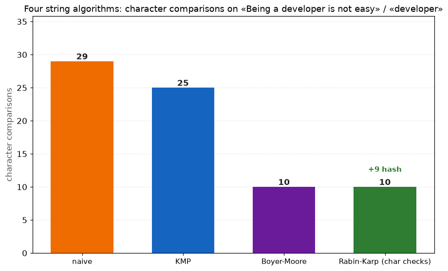

Rabin-Karp does the **fewest character** comparisons — because it mostly compares **hashes** (integers) and checks characters only on a hash match. On the pathological input `"aaaa…"` under a good prime modulus it does **0** character comparisons (all windows are filtered out by hash).

**Where to next.** Rabin-Karp generalizes naturally: **multi-pattern RK** hashes a whole set of patterns and finds them all in one pass; and **Rabin fingerprinting** underlies plagiarism detection and file comparison. The same idea works everywhere: **string → number**.

<a id="summary"></a>

## Summary

- **Rabin-Karp** searches for a substring by **hashing**: a string becomes a number, and the algorithm compares **window hashes** with the pattern's hash, checking characters only on a hash match.
- **Polynomial hash:** $h(s) = \sum_i s[i]\cdot b^{\,n-i-1} \bmod m$. References: `abc → 6382179 → 90`, `developer → 35`, `general → 82`.
- **Rolling hash** updates the window hash in $O(1)$ (subtract the left character, add the right one) — instead of recomputing from scratch in $O(m)$.
- **Collisions** — equal hashes ≠ equal strings (`for` and `jar` → both `35`); hence a character check is mandatory on a hash match. A modulus and a prime reduce collisions.
- **Complexity:** $O(n+m)$ on average, $O(n\cdot m)$ in the worst case; the algorithm shines when matches are few and when occurrences are many.
- The synopsis example `rabin_karp_search("Being a developer is not easy", "developer")` prints **Substring found at index 8**.

---

<a id="license"></a>

## License

[MIT](LICENSE) © 2026 Maryna Shavlak
