# Алгоритм Рабіна-Карпа (Rabin-Karp, хешування): покроковий розбір

[](https://github.com/MarynaShavlak/algo-rabin-karp-string-search)

**🇺🇦 Українська**  ·  [🇬🇧 English](README.en.md)

**Алгоритм Рабіна-Карпа** — це алгоритм пошуку підрядка (шаблону) в рядку тексту **за допомогою хешування**. Він розв'язує ту саму задачу, що й попередні алгоритми серії ([наївний](https://github.com/MarynaShavlak/algo-naive-string-search), [KMP](https://github.com/MarynaShavlak/algo-knuth-morris-pratt-search), [Боєра-Мура](https://github.com/MarynaShavlak/algo-boyer-moore-string-search)): знайти, з якої позиції **шаблон** входить у **головний рядок** (текст). Але робить це **принципово інакше**.

Наївний метод, KMP і Боєра-Мура звіряють **символи**. Рабін-Карп звіряє **числа**: він перетворює рядок на **хеш** і на кожному вирівнюванні порівнює **хеш вікна** з **хешем шаблону**. Порівняти два цілих дешево; **посимвольну** перевірку алгоритм робить **лише тоді, коли хеші збіглися** — бо різні рядки можуть мати однаковий хеш (це **колізія**). Алгоритм особливо ефективний, коли можливих входжень багато.

Головна ідея — **віконний підхід**: вікно завдовжки з шаблон ковзає вздовж тексту. Два нові герої розбору:

1. **Поліноміальний хеш** — рядок стає числом: $h(s) = \sum_{i=0}^{n-1} s[i]\cdot b^{\,n-i-1} \bmod m$.
2. **Ковзний хеш (rolling hash)** — хеш наступного вікна перераховується за $O(1)$: відняти внесок старого (лівого) символу, домножити на базу, додати новий (правий) — замість перерахунку з нуля за $O(m)$.

Репозиторій — навчальний матеріал: чиста реалізація алгоритму (дослівно з конспекту) + докладні візуалізації кожного кроку. Увесь розбір нижче відтворюється кодом із [`examples/`](examples), а рисунки лежать у [`docs/images/`](docs/images).

---

## Зміст

- [Структура репозиторію](#repo-structure)
- [Швидкий старт](#quickstart)
- **Теорія**
  - [Інтуїція: чому хеш замість символів](#intuition)
  - [Дві фази Рабіна-Карпа](#two-phases)
- **Фаза 1 — поліноміальний хеш (рядок → число)**
  - [Формула й код `polynomial_hash`](#hash-code)
  - [Сигнатурний приклад: `abc` → 6382179 → 90](#hash-abc)
  - [Ще хеші: `developer` → 35, `general` → 82](#hash-more)
- **Фаза 2 — пошук**
  - [Код `rabin_karp_search` (з конспекту)](#search-code)
  - [Приклад із конспекту: пошук «developer» → 8](#search-konspekt)
  - [Ковзний хеш (rolling): оновлення за `O(1)`](#rolling)
- **Колізії — унікальна перлина**
  - [Різні рядки, однаковий хеш](#collisions)
  - [Колізія під час пошуку: навіщо char-перевірка](#collision-search)
  - [Модульна арифметика: навіщо модуль і просте число](#modular)
- **Складність**
  - [`O(n+m)` у середньому проти `O(n·m)` у найгіршому](#complexity)
- [Покрокове виконання коду: панелі «код ↔ дані»](#code-walkthrough)
- [Повне покрокове трасування конспект-прикладу](#full-walkthrough)
- **Підсумки**
  - [Властивості та крайові випадки](#properties)
  - [Чотири рядкові алгоритми: підсумкова таблиця](#series)
  - [Підсумок](#summary)
- [Ліцензія](#license)

---

<a id="repo-structure"></a>

## Структура репозиторію

Дерево каталогів і розподіл відповідальностей між модулями винесено в окремий файл — **[PROJECT_STRUCTURE.md](PROJECT_STRUCTURE.md)**.

---

<a id="quickstart"></a>

## Швидкий старт

Команди встановлення, запуску прикладів і тестів, а також мінімальний приклад використання як бібліотеки — у файлі **[USAGE.md](USAGE.md)**.

---

<a id="intuition"></a>

## Інтуїція: чому хеш замість символів

Уявімо, що шукаємо шаблон у довгому тексті. Наївний метод на кожному вирівнюванні звіряє символи **один за одним**. Рабін-Карп робить інакше: він заздалегідь стискає шаблон в одне **число** — його **хеш** — і так само рахує хеш кожного вікна тексту. Тоді замість того, щоб порівнювати рядки символ за символом, він порівнює **два цілих числа** — це одна дешева операція.


Звісно, хеш «втрачає інформацію»: різні рядки можуть дати однаковий хеш. Тому на **збігу хешів** алгоритм робить **додаткову посимвольну перевірку** — підтвердити, що знайшов саме шаблон, а не випадковий рядок із таким самим хешем. Якщо хеші **різні**, рядки точно різні — і вікно просто ковзає далі.

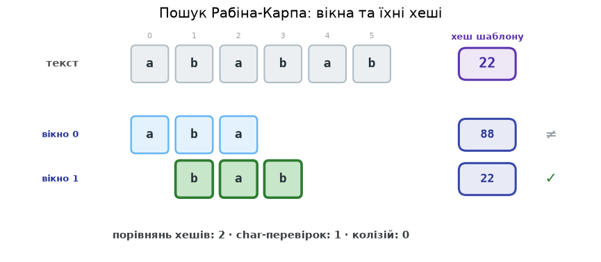

Щоб рахувати хеш кожного вікна швидко, Рабін-Карп використовує **ковзний хеш**: новий хеш виходить зі старого за $O(1)$, без перерахунку з нуля. Саме це робить алгоритм ефективним.

<a id="two-phases"></a>

## Дві фази Рабіна-Карпа

| Фаза | Що робить | Складність |
|---|---|---|
| **1. Хешування** | `polynomial_hash(s)` перетворює рядок на число | $O(m)$ на шаблон, $O(1)$ на кожне нове вікно (rolling) |
| **2. Пошук** | `rabin_karp_search(text, pattern)` ковзає вікном, порівнює хеші, на збігу — звіряє символи | $O(n+m)$ у середньому |

Нижче розберемо кожну фазу окремо.

---

<a id="hash-code"></a>

## Фаза 1 — поліноміальний хеш (рядок → число)

Поліноміальне хешування розглядає кожен символ рядка як **коефіцієнт полінома** з базою $b$ (зазвичай просте число; тут 256 — з огляду на розмір ASCII-таблиці). Загальна формула для рядка $s$ довжиною $n$:

$$h(s) = \sum_{i=0}^{n-1} s[i]\cdot b^{\,n-i-1} \bmod m,$$

де $s[i]$ — числовий код символу (`ord`), $b$ — база, $m$ — модуль (тут просте 101). Ось реалізація з конспекту — її ми й розбираємо рядок за рядком (повна версія з документацією — у [`rabin_karp_string_search/core.py`](rabin_karp_string_search/core.py)):

```python
def polynomial_hash(s, base=256, modulus=101):
    n = len(s)
    hash_value = 0
    for i, char in enumerate(s):
        power_of_base = pow(base, n - i - 1) % modulus
        hash_value = (hash_value + ord(char) * power_of_base) % modulus
    return hash_value
```

Тут `pow(base, n - i - 1) % modulus` — це база, піднесена до степеня `n-i-1` за модулем. Модуль забезпечує, що хеш завжди менший за задане число, **запобігаючи переповненню** (про це — нижче).

<a id="hash-abc"></a>

### Сигнатурний приклад: `abc` → 6382179 → 90

Розгляньмо рядок `"abc"` і базу `256`. Спершу **без модуля**:

$$h = \text{ord}(\texttt{a})\cdot 256^2 + \text{ord}(\texttt{b})\cdot 256^1 + \text{ord}(\texttt{c})\cdot 256^0 = 6356992 + 25088 + 99 = 6382179.$$

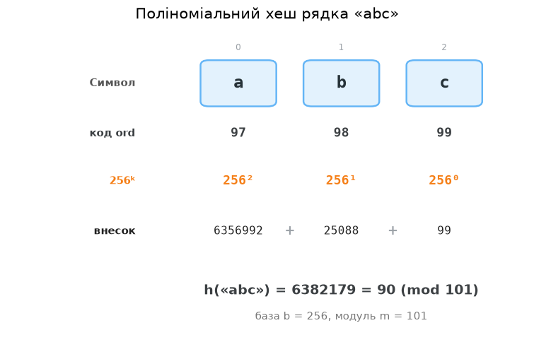

Число `6382179` уже чимале — а на довгих рядках воно росте експоненційно й переповнить будь-який тип. Тому беремо його **за модулем 101**:

$$6382179 \bmod 101 = 90.$$

Друкує хеші приклад [`examples/01_polynomial_hash.py`](examples/01_polynomial_hash.py) — рівно як у конспекті:

```text
polynomial_hash("abc") = 90
polynomial_hash("developer") = 35
polynomial_hash("general") = 82
```

<a id="hash-more"></a>

### Ще хеші: `developer` → 35, `general` → 82

На практиці `polynomial_hash` не зводить весь поліном в одне велике число, а **накопичує** хеш крок за кроком за модулем (схема Горнера) — тож проміжні значення завжди лишаються малими. Ось повна покрокова акумуляція для шаблону `"developer"`:

```text
Покрокова Horner-акумуляція для «developer»:
  i=0: + ord(«d»)·79 → hash = 22
  i=1: + ord(«e»)·37 → hash = 22
  i=2: + ord(«v»)·25 → hash = 43
  i=3: + ord(«e»)·36 → hash = 43
  i=4: + ord(«l»)·68 → hash = 14
  i=5: + ord(«o»)·5 → hash = 64
  i=6: + ord(«p»)·88 → hash = 22
  i=7: + ord(«e»)·54 → hash = 22
  i=8: + ord(«r»)·1 → hash = 35
```

> Цікавий збіг: `ord("e") = 101` — точно дорівнює модулю, тож **кожна** «e» додає `101·… mod 101 = 0` і не змінює хеш (кроки `i=1, 3, 7`). Це наочно показує, що окремий символ може зробити нульовий внесок за модулем.

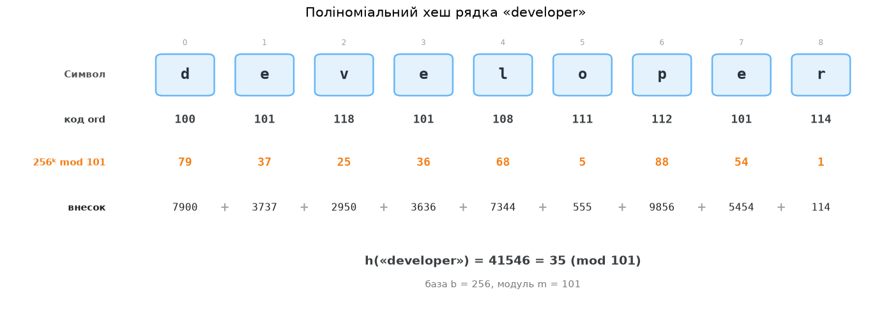

▶️ Побудова хешу в русі (Horner-акумуляція):

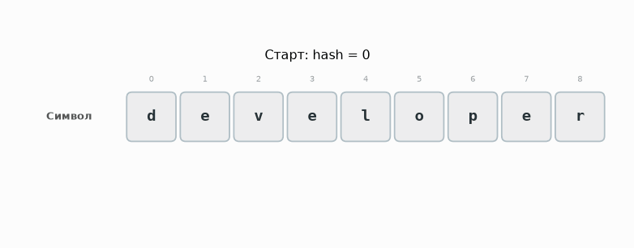

🎬 *MP4-версія:* [`hash_build.mp4`](docs/images/hash_build.mp4)

---

<a id="search-code"></a>

## Фаза 2 — пошук

### Код `rabin_karp_search` (з конспекту)

```python
def rabin_karp_search(main_string, substring):
    # Довжини основного рядка та підрядка пошуку
    substring_length = len(substring)
    main_string_length = len(main_string)
    # Базове число для хешування та модуль
    base = 256
    modulus = 101
    # Хеш-значення для підрядка пошуку та поточного відрізка в основному рядку
    substring_hash = polynomial_hash(substring, base, modulus)
    current_slice_hash = polynomial_hash(main_string[:substring_length], base, modulus)
    # Попереднє значення для перерахунку хешу
    h_multiplier = pow(base, substring_length - 1) % modulus
    # Проходимо крізь основний рядок
    for i in range(main_string_length - substring_length + 1):
        if substring_hash == current_slice_hash:
            if main_string[i:i+substring_length] == substring:
                return i
        if i < main_string_length - substring_length:
            current_slice_hash = (current_slice_hash - ord(main_string[i]) * h_multiplier) % modulus
            current_slice_hash = (current_slice_hash * base + ord(main_string[i + substring_length])) % modulus
            if current_slice_hash < 0:
                current_slice_hash += modulus
    return -1
```

Логіка пошуку (з конспекту):

1. Обчислити хеш **шаблону** (`substring_hash`) і хеш **першого вікна** тексту (`current_slice_hash`).
2. Порівняти хеші вікна й шаблону:
   - якщо **збіглися** → зробити **додаткову посимвольну перевірку** (`main_string[i:i+m] == substring`); якщо вона пройшла — повернути позицію `i`;
   - якщо **різні** → просто зсунути вікно на 1.
3. Зсуваючи вікно, **перерахувати хеш**, віднявши старий (лівий) символ і додавши новий (правий) — це rolling hash, замість перерахунку з нуля.
4. Якщо жодне вікно не дало підтвердженого збігу — повернути `-1`.

<a id="search-konspekt"></a>

### Приклад із конспекту: пошук «developer» → 8

Відтворимо головний приклад конспекту. Драйвер дослівно:

```python
main_string = "Being a developer is not easy"
substring = "developer"
position = rabin_karp_search(main_string, substring)
if position != -1:
    print(f"Substring found at index {position}")
else:
    print("Substring not found")
```

Виводить рівно:

```text
Substring found at index 8
```

Підрядок «developer» починається на позиції 8. Хеш шаблону — `35`. Ось повне трасування пошуку (одне вікно на рядок) — друкує [`examples/02_search.py`](examples/02_search.py):

```text
  i  | вікно | хеш вікна | хеш шаблону | вердикт
  ----------------------------------------------
   0 | Being␣a␣d |    37     |     35      | хеші різні
   1 | eing␣a␣de |    10     |     35      | хеші різні
   2 | ing␣a␣dev |    52     |     35      | хеші різні
   3 | ng␣a␣deve |    86     |     35      | хеші різні
   4 | g␣a␣devel |    92     |     35      | хеші різні
   5 | ␣a␣develo |    82     |     35      | хеші різні
   6 | a␣develop |    35     |     35      | колізія (char-перевірка відкидає)
   7 | ␣develope |    67     |     35      | хеші різні
   8 | developer |    35     |     35      | справжній збіг
```

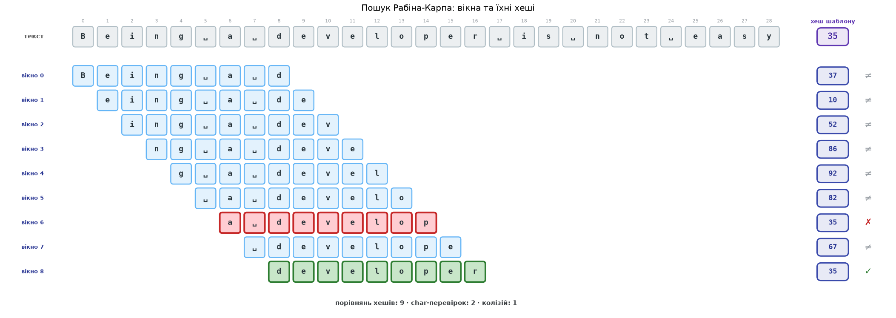

Зверніть увагу на **зміщення 6**: вікно `"a develop"` має хеш `35` — **той самий**, що й шаблон! Але посимвольна перевірка показує, що `"a develop" ≠ "developer"` — це **колізія**, і алгоритм ковзає далі. Справжній збіг — аж на зміщенні 8. Усього: 9 порівнянь хешів, але лише **2** посимвольні перевірки (з них 1 колізія).

▶️ Пошук конспект-прикладу в русі (вікно ковзає, хеш «котиться»):

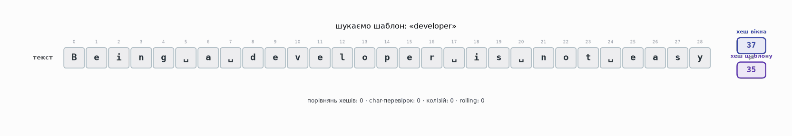

🎬 *MP4-версія:* [`search_konspekt.mp4`](docs/images/search_konspekt.mp4)

Якщо шаблону немає, драйвер друкує `Substring not found` (а функція повертає `-1`).

<a id="rolling"></a>

### Ковзний хеш (rolling): оновлення за `O(1)`

Найдорожче у віконному пошуку — рахувати хеш кожного вікна. Якщо робити це **з нуля** (`polynomial_hash` усього вікна), вийде $O(m)$ на крок і $O(n\cdot m)$ загалом. **Rolling hash** перетворює перерахунок на $O(1)$: коли вікно зсувається на 1, лівий символ **виходить**, а правий **входить** — тож:

```python
current_slice_hash = (current_slice_hash - ord(main_string[i]) * h_multiplier) % modulus
current_slice_hash = (current_slice_hash * base + ord(main_string[i + substring_length])) % modulus
if current_slice_hash < 0:
    current_slice_hash += modulus
```

Тут `h_multiplier = pow(base, m-1) % modulus` — це **вага** найлівішого символу (база у степені `m-1`), яку потрібно відняти. Останні два рядки виправляють можливе **від'ємне** проміжне значення (через `%` від різниці).

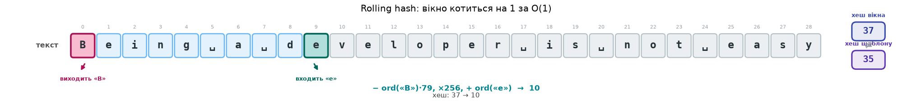

Виграш видно одразу. Скільки «символьних операцій» коштує хешування всіх вікон (друкує [`examples/03_rolling_collisions.py`](examples/03_rolling_collisions.py)):

```text
Rolling hash: O(1)-оновлення проти перерахунку з нуля O(m)
  n= 8: rolling 12 символьних операцій, перерахунок 20
  n=16: rolling 28 символьних операцій, перерахунок 52
  n=32: rolling 60 символьних операцій, перерахунок 116
  n=64: rolling 124 символьних операцій, перерахунок 244
```

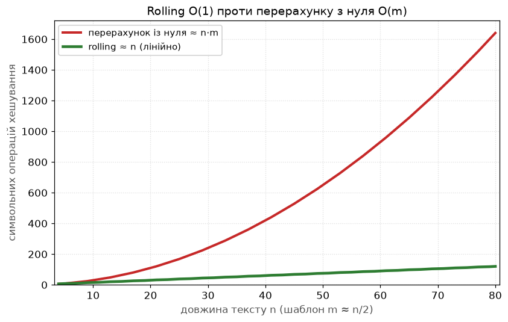

Rolling росте **лінійно** за `n`, перерахунок з нуля — як `n·m`.

---

<a id="collisions"></a>

## Колізії — унікальна перлина

У нашому коді ми беремо підрядок і конвертуємо його в числове значення — хеш. **Якщо два рядки однакові, їхні хеші теж будуть однаковими — завжди.** Однак навпаки це не завжди вірно: **два різні рядки можуть мати однаковий хеш**, і таке явище називається **колізією**. Саме тому ми й виконуємо додаткове посимвольне порівняння для підтвердження.

### Різні рядки, однаковий хеш

Параметри тут фіксовані `(base=256, modulus=101)`, тож конкретну колізію можна знайти **скануванням** простору рядків. Ось класична пара — слова `"for"` і `"jar"` мають **однаковий** хеш `35`, хоча це різні рядки:

```text
Колізії під (base=256, modulus=101): різні рядки — однаковий хеш
  «for» і «jar»: hash = 35 (а рядки різні!)
  «heap» і «user»: hash = 12 (а рядки різні!)
```

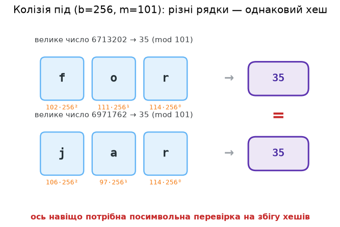

«Велике число» без модуля у них **різне** (`6713202` проти `6971762`), а от за модулем 101 обидва дають `35`. Саме модульна арифметика «склеює» різні числа в один хеш — і породжує колізії.

<a id="collision-search"></a>

### Колізія під час пошуку: навіщо char-перевірка

Тепер найважливіше — **колізія під час самого пошуку**. Шукаймо `"jar"` у тексті `"for a jar of jam"`. Найперше вікно — `"for"` — має хеш `35`, **точно як шаблон `"jar"`**! Без посимвольної перевірки алгоритм оголосив би хибний збіг. Але перевірка `"for" == "jar"` провалюється — це колізія, і пошук триває; справжній `"jar"` знаходиться на зміщенні 6:

```text
Пошук «jar» у «for a jar of jam»:
  порівнянь хешів 7, char-перевірок 2, з них колізій 1, збіг на 6
```

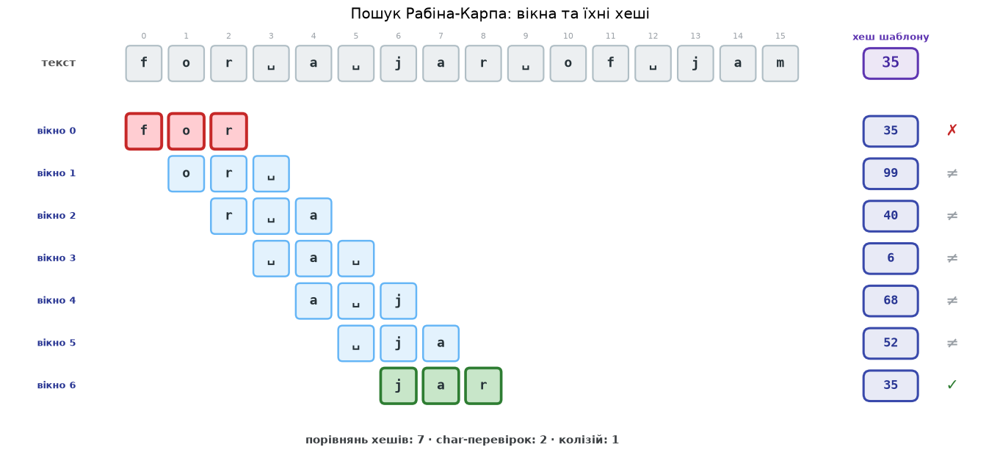

Червоне вікно (зміщення 0) — **колізія**: хеш збігся, але char-перевірка відкинула. Зелене (зміщення 6) — справжній збіг. **Ось навіщо потрібна посимвольна перевірка на збігу хешів.**

▶️ Колізія під час пошуку в русі:

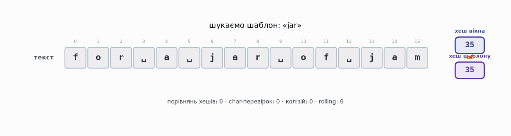

🎬 *MP4-версія:* [`search_collision.mp4`](docs/images/search_collision.mp4)

<a id="modular"></a>

### Модульна арифметика: навіщо модуль і просте число

**Навіщо модуль.** Без нього хеш росте експоненційно: уже `"developer"` дає 22-значне число, а на довгих рядках — переповнення. Модуль тримає хеш у діапазоні `[0, m)`.

**Чому просте число.** Простий модуль (тут 101) **рівномірніше** розподіляє хеші, тож колізії рідші. Компроміс прямий: **малий або невдалий модуль → більше колізій → повільніше**. Якщо взяти найгірший модуль `1`, **усі** хеші стають `0`, кожне вікно «збігається» хешем, і char-перевірка спрацьовує **щоразу** — Рабін-Карп вироджується в наївний метод:

```text
Модульна арифметика: навіщо модуль і чому просте число
  без модуля хеш «developer» = 1851985549932438250866 (≈ 22 цифр) — переповнення
  «aaaaaaaaaaaaaaaa» / «aaaaaaab»:
    модуль 101 (просте): колізій 0, char-порівнянь 0 — RK швидкий
    модуль 1 (найгірший): колізій 9, char-порівнянь 72 — RK = наївний
```

---

<a id="complexity"></a>

## Складність: `O(n+m)` у середньому проти `O(n·m)` у найгіршому

Алгоритм Рабіна-Карпа має таку асимптотичну складність:

| Випадок | Час | Коли |
|---|---|---|
| **середній / найкращий** | $O(n + m)$ | хеш-функція розподіляє рівномірно, колізії рідкісні — на практиці близько до лінійної |
| **найгірший** | $O(n \cdot m)$ | багато хеш-колізій → багато прямих порівнянь підрядків (зокрема при невдалому/малому модулі) |

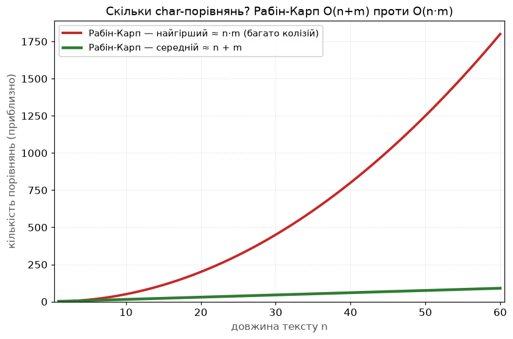

Перевага Рабіна-Карпа — ефективність для реальних умов, коли збігів мало; а ще він **чудовий для багатьох входжень** (хеш-порівняння лишаються дешевими). Повільнішим він стає, коли хеші часто збігаються, а підрядки — ні (через додаткові порівняння).

---

<a id="code-walkthrough"></a>

## Покрокове виконання коду: панелі «код ↔ дані»

Приклади вище показували *результат* кожного кроку. Тут — **сам код у дії**: ліворуч фрагмент алгоритму з **підсвіченими активними рядками**, праворуч — дані саме в цей момент. **Колір рядка коду кодує гілку:** 🟡 активний рядок, 🟠 збіг хешу (кандидат), 🟢 підтверджено / знайдено, 🔴 колізія / не знайдено, 🔵 rolling-оновлення. Дві функції — дві панелі; генерує приклад [`examples/05_code_walkthrough.py`](examples/05_code_walkthrough.py).

**Хешування — `polynomial_hash` для `"abc"`** (праворуч — символи й накопичений хеш):

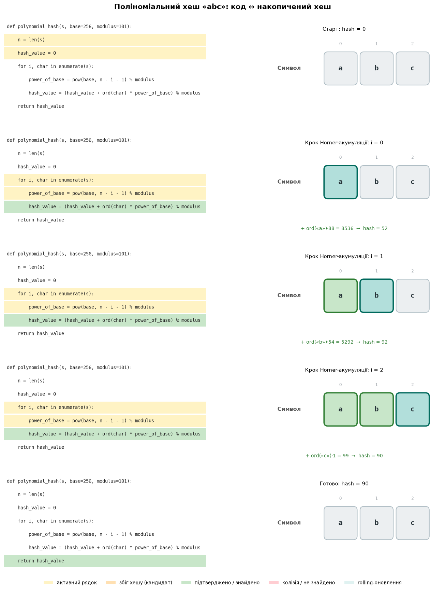

▶️ [Анімація хешування](docs/images/code_hash_walk.gif) · 🎬 [`code_hash_walk.mp4`](docs/images/code_hash_walk.mp4)

**Пошук — `rabin_karp_search` для `"jar"` у `"for jar"`** (праворуч — ковзне вікно з хеш-бейджем; на зміщенні 0 — колізія):

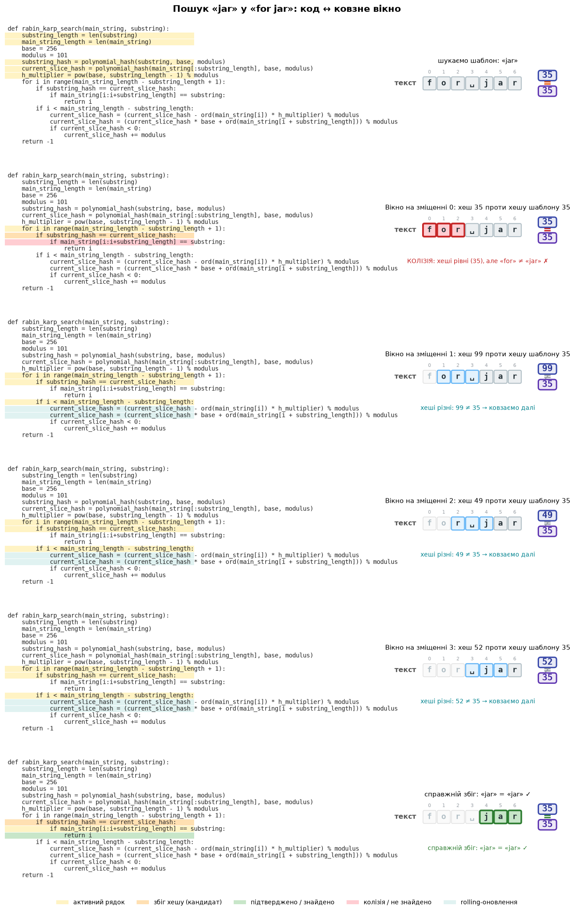

▶️ [Анімація пошуку](docs/images/code_search_walk.gif) · 🎬 [`code_search_walk.mp4`](docs/images/code_search_walk.mp4)

---

<a id="full-walkthrough"></a>

## Повне покрокове трасування конспект-прикладу

Нижче — те саме виконання, але **повністю** й у дві фази: спершу обчислення хешу шаблону «developer», тоді сам пошук у тексті конспекту. Кожен крок — окремим кадром «код ↔ дані» з детальним поясненням під ним. Кольори ті самі, що в [легенді вище](#code-walkthrough). Блок згенеровано автоматично з журналів подій (приклад [`examples/06_full_walkthrough.py`](examples/06_full_walkthrough.py)).

<!-- WALKTHROUGH:START -->

### Фаза 1 — хешування: поліноміальний хеш шаблону «developer»

#### Крок H00

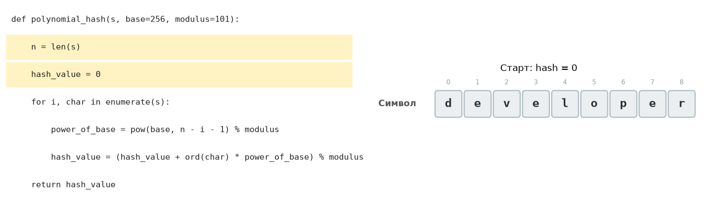

Фаза 1 — **хешування**. Перетворюємо шаблон «developer» (довжина 9) на число — поліноміальний хеш за модулем 101. Починаємо з `hash = 0` і додаємо внесок кожного символу зліва направо (схема Горнера).

#### Крок H01

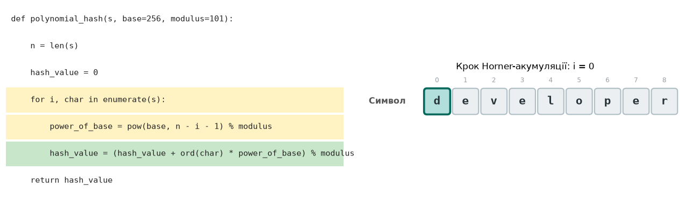

Крок `i = 0`: символ «d» (код `ord = 100`). Степінь `pow(256, 8) % 101 = 79`, внесок `100·79 = 7900`. Накопичений `hash = 22`.

#### Крок H02

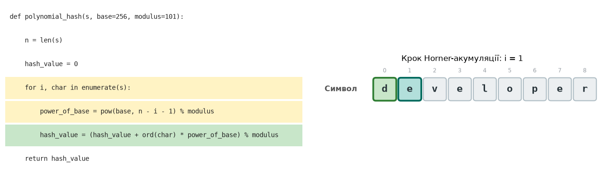

Крок `i = 1`: символ «e» (код `ord = 101`). Степінь `pow(256, 7) % 101 = 37`, внесок `101·37 = 3737`. Накопичений `hash = 22`.

#### Крок H03

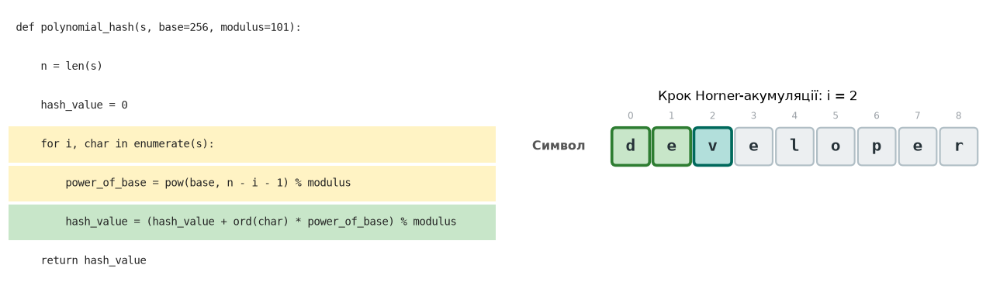

Крок `i = 2`: символ «v» (код `ord = 118`). Степінь `pow(256, 6) % 101 = 25`, внесок `118·25 = 2950`. Накопичений `hash = 43`.

#### Крок H04

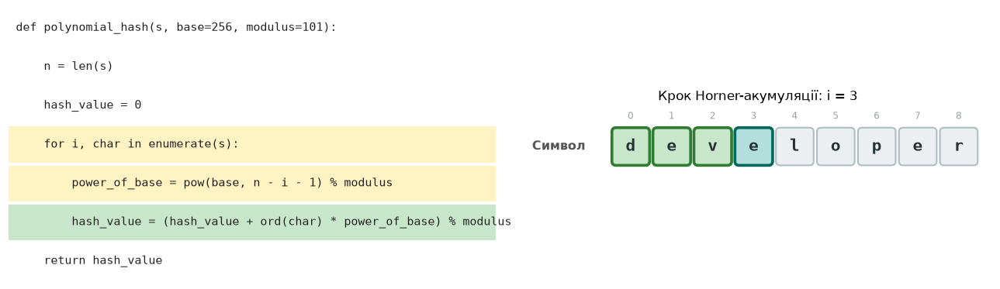

Крок `i = 3`: символ «e» (код `ord = 101`). Степінь `pow(256, 5) % 101 = 36`, внесок `101·36 = 3636`. Накопичений `hash = 43`.

#### Крок H05

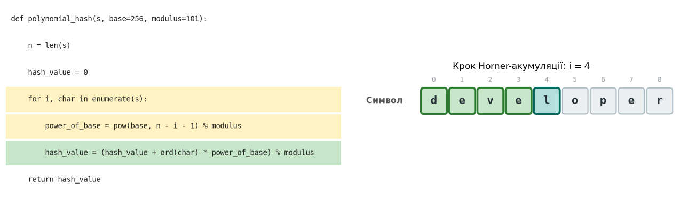

Крок `i = 4`: символ «l» (код `ord = 108`). Степінь `pow(256, 4) % 101 = 68`, внесок `108·68 = 7344`. Накопичений `hash = 14`.

#### Крок H06

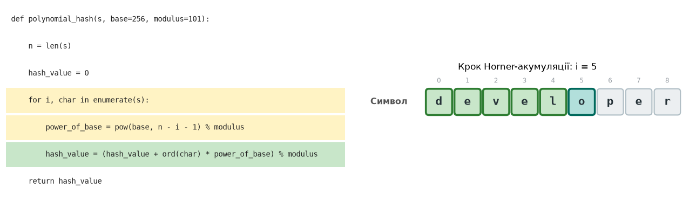

Крок `i = 5`: символ «o» (код `ord = 111`). Степінь `pow(256, 3) % 101 = 5`, внесок `111·5 = 555`. Накопичений `hash = 64`.

#### Крок H07

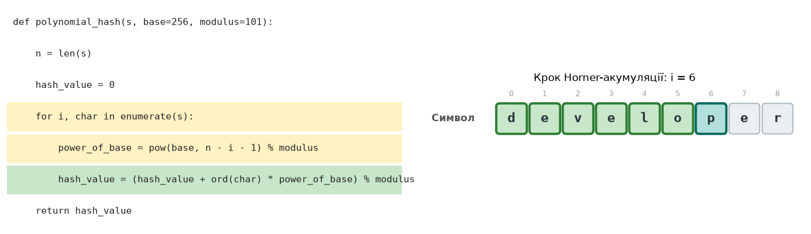

Крок `i = 6`: символ «p» (код `ord = 112`). Степінь `pow(256, 2) % 101 = 88`, внесок `112·88 = 9856`. Накопичений `hash = 22`.

#### Крок H08

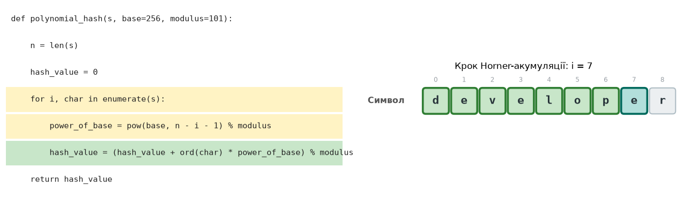

Крок `i = 7`: символ «e» (код `ord = 101`). Степінь `pow(256, 1) % 101 = 54`, внесок `101·54 = 5454`. Накопичений `hash = 22`.

#### Крок H09

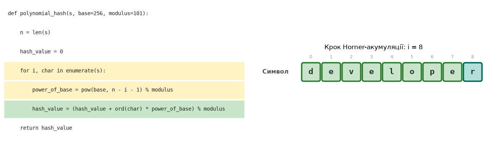

Крок `i = 8`: символ «r» (код `ord = 114`). Степінь `pow(256, 0) % 101 = 1`, внесок `114·1 = 114`. Накопичений `hash = 35`.

#### Крок H10

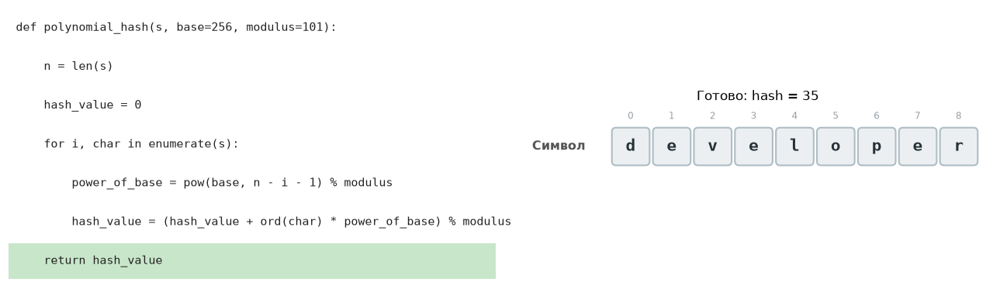

Хеш шаблону «developer» обчислено: **35**. Саме це число ми порівнюватимемо з хешем кожного вікна тексту — замість того, щоб звіряти символи.

### Фаза 2 — пошук «developer» у тексті конспекту

#### Крок S00

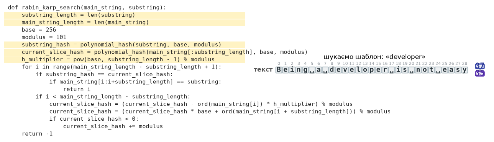

Фаза 2 — **пошук**. Хеш шаблону «developer» дорівнює **35**. Вікно завдовжки 9 ковзає текстом; на кожному зміщенні порівнюємо **хеш вікна** з 35. Символи звіряємо лише тоді, коли хеші збіглися.

#### Крок S01

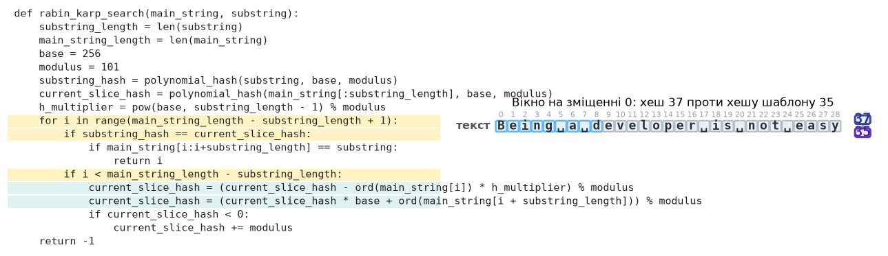

Вікно на зміщенні `i = 0` — «Being␣a␣d», його хеш **37** ≠ 35. Не збіглося, тож ковзаємо далі. Новий хеш рахуємо за `O(1)` (rolling): лівий символ виходить, правий входить.

#### Крок S02

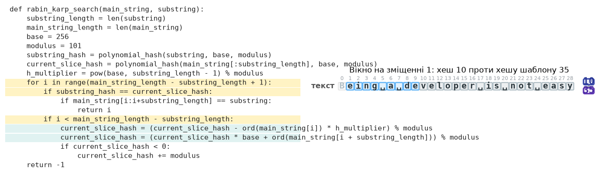

Вікно на зміщенні `i = 1` — «eing␣a␣de», його хеш **10** ≠ 35. Не збіглося, тож ковзаємо далі. Новий хеш рахуємо за `O(1)` (rolling): лівий символ виходить, правий входить.

#### Крок S03

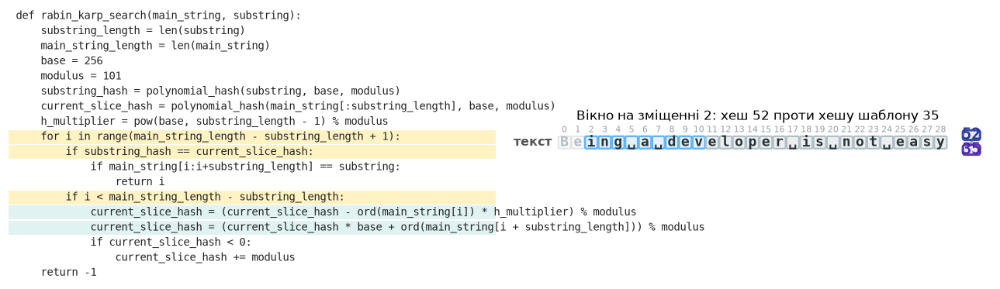

Вікно на зміщенні `i = 2` — «ing␣a␣dev», його хеш **52** ≠ 35. Не збіглося, тож ковзаємо далі. Новий хеш рахуємо за `O(1)` (rolling): лівий символ виходить, правий входить.

#### Крок S04

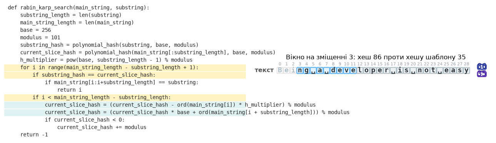

Вікно на зміщенні `i = 3` — «ng␣a␣deve», його хеш **86** ≠ 35. Не збіглося, тож ковзаємо далі. Новий хеш рахуємо за `O(1)` (rolling): лівий символ виходить, правий входить.

#### Крок S05

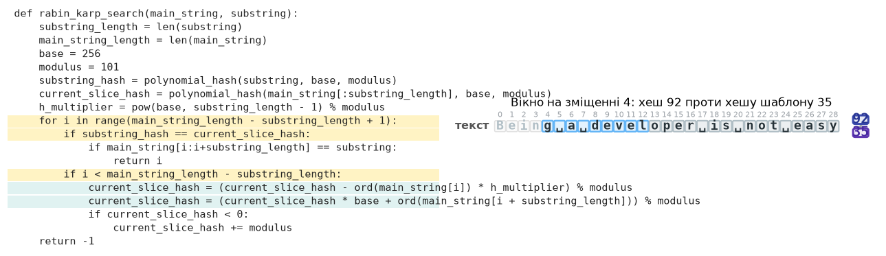

Вікно на зміщенні `i = 4` — «g␣a␣devel», його хеш **92** ≠ 35. Не збіглося, тож ковзаємо далі. Новий хеш рахуємо за `O(1)` (rolling): лівий символ виходить, правий входить.

#### Крок S06


Вікно на зміщенні `i = 5` — «␣a␣develo», його хеш **82** ≠ 35. Не збіглося, тож ковзаємо далі. Новий хеш рахуємо за `O(1)` (rolling): лівий символ виходить, правий входить.

#### Крок S07

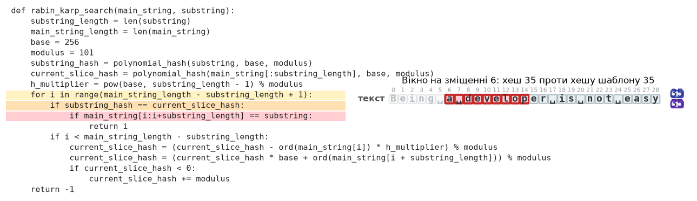

Вікно `i = 6` — «a␣develop», хеш **35 = 35** — збіг ХЕШУ! Але посимвольна перевірка: «a␣develop» ≠ «developer». Це **КОЛІЗІЯ** — різні рядки з однаковим хешем. Саме тут char-перевірка рятує від хибного збігу: відкидаємо й ковзаємо далі.

#### Крок S08

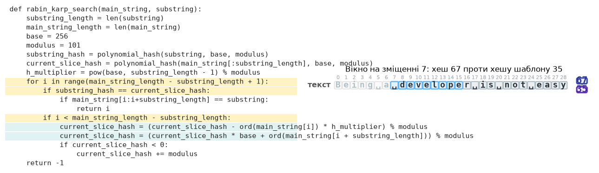

Вікно на зміщенні `i = 7` — «␣develope», його хеш **67** ≠ 35. Не збіглося, тож ковзаємо далі. Новий хеш рахуємо за `O(1)` (rolling): лівий символ виходить, правий входить.

#### Крок S09

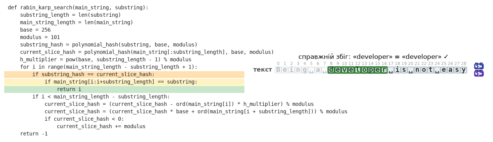

Вікно `i = 8` — «developer», хеш **35 = 35**, і перевірка: «developer» = «developer» ✓ — **справжній збіг**! Повертаємо позицію 8. Підсумок: 9 порівнянь хешів, лише 2 char-перевірки (з них 1 колізія), 8 rolling-оновлень.

<!-- WALKTHROUGH:END -->

---

<a id="properties"></a>

## Властивості та крайові випадки

- **Складність:** $O(n+m)$ у середньому, $O(n\cdot m)$ у найгіршому (багато колізій); $O(1)$ додаткової пам'яті (лише кілька змінних під хеші).
- **Хеш замість символів:** алгоритм порівнює **числа**; посимвольна перевірка лише **підтверджує** збіг хешів. Це зводить порівняння рядків до порівняння цілих.
- **Чудовий для багатьох входжень:** `rabin_karp_search_all` знаходить усі позиції одним проходом, лишаючи хеш-порівняння дешевими.

Крайові випадки (перевірені в [`tests/`](tests)):

| Випадок | Поведінка |
|---|---|
| шаблон **дорівнює** тексту | позиція `0` |
| шаблон **довший** за текст | `-1` (діапазон вікон порожній; хеш першого зрізу все одно рахується без падіння) |
| шаблон з **одного символу** | звичайний пошук |
| **порожній** шаблон | `pow(base, -1)` дав би **float** (готча дослівного коду); безпечну обробку (`0`) дають `rabin_karp_search_all` і `rabin_karp_search_steps` |
| **колізія** | хеш збігся, рядки різні → посимвольна перевірка **відкидає** хибний збіг (саме цей інваріант — окремий тест) |
| **множинні** входження | `rabin_karp_search` повертає перше; `rabin_karp_search_all` — усі |

> **Критичний інваріант (тест):** rolling-хеш кожного вікна **дорівнює** `polynomial_hash` цього вікна, порахованому з нуля. Тобто $O(1)$-оновлення дає рівно той самий результат, що й повний перерахунок — лише швидше.

<a id="series"></a>

## Чотири рядкові алгоритми: підсумкова таблиця

Рабін-Карп — **четвертий і фінальний** рядковий алгоритм серії, її **капстоун**. Зведімо всі чотири підходи. Кожен звіряє підрядок із текстом, але робить це по-своєму:

| Алгоритм | Час (гірший) | Передобробка | Головна ідея |
|---|---|---|---|
| [**Наївний**](https://github.com/MarynaShavlak/algo-naive-string-search) | $O(n \cdot m)$ | немає | перевіряє **кожне** місце, посимвольно зліва направо |
| [**KMP**](https://github.com/MarynaShavlak/algo-knuth-morris-pratt-search) | $O(n + m)$ **гарантовано** | префіксна функція `lps` за $O(m)$ | стрибок за `lps`; індекс тексту не відкочується |
| [**Боєра-Мура**](https://github.com/MarynaShavlak/algo-boyer-moore-string-search) | $O(n \cdot m)$, **швидкий на практиці** | таблиця поганого символу | звіряє **справа наліво**, великі стрибки |
| **Рабіна-Карпа** (цей розбір) | $O(n + m)$ у середньому, $O(n\cdot m)$ у найгіршому | хеш шаблону за $O(m)$ | **ХЕШУВАННЯ**: rolling hash, порівняння чисел, char-перевірка лише на збігу хешів |

Звіримо кількість **посимвольних** порівнянь усіх чотирьох на тих самих входах — друкує [`examples/04_complexity.py`](examples/04_complexity.py):

```text
  вхід                             | наївний |  KMP  | Боєра-Мура  | Рабіна-Карпа (char + hash)
  ---------------------------------------------------------------------------------------------
  конспект «developer»             |   29    |  25   |     10      | 10 char + 9 hash
  патологічний «aaaa…» / «aaaaab»  |   114   |  52   |     19      | 0 char + 19 hash
```

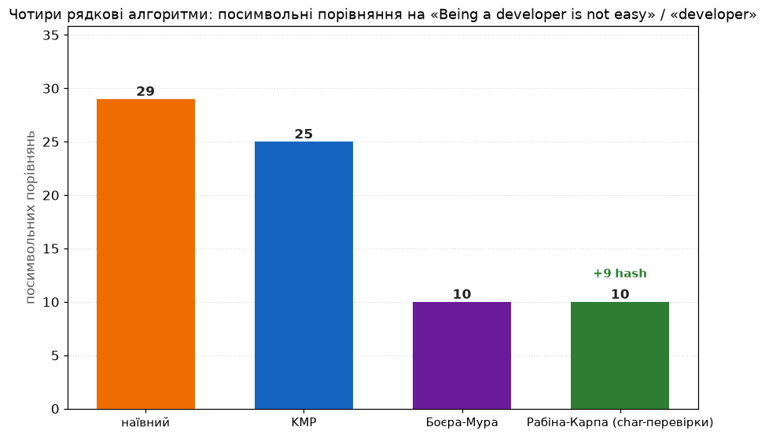

Рабін-Карп робить **найменше посимвольних** порівнянь — бо здебільшого порівнює **хеші** (цілі числа), а символи звіряє лише на збігу хешів. На патологічному вході `"aaaa…"` під добрим простим модулем він робить **0** посимвольних порівнянь (усі вікна відсіюються за хешем).

**Куди далі.** Рабін-Карп природно узагальнюється: **багатошаблонний RK** хешує цілий набір патернів і шукає їх усі за один прохід; а **дактилоскопія Рабіна** (Rabin fingerprints) лежить в основі виявлення плагіату та порівняння файлів. Скрізь працює та сама ідея: **рядок → число**.

<a id="summary"></a>

## Підсумок

- **Рабін-Карп** шукає підрядок **хешуванням**: рядок стає числом, і алгоритм порівнює **хеші вікон** із хешем шаблону, а символи звіряє лише на збігу хешів.
- **Поліноміальний хеш:** $h(s) = \sum_i s[i]\cdot b^{\,n-i-1} \bmod m$. Еталони: `abc → 6382179 → 90`, `developer → 35`, `general → 82`.
- **Rolling hash** оновлює хеш вікна за $O(1)$ (відняти лівий символ, додати правий) — замість перерахунку з нуля за $O(m)$.
- **Колізії** — рівні хеші ≠ рівні рядки (`for` і `jar` → обидва `35`); тому на збігу хешів обов'язкова посимвольна перевірка. Модуль і просте число зменшують колізії.
- **Складність:** $O(n+m)$ у середньому, $O(n\cdot m)$ у найгіршому; алгоритм чудовий, коли збігів мало й коли входжень багато.
- Приклад конспекту `rabin_karp_search("Being a developer is not easy", "developer")` друкує **Substring found at index 8**.

---

<a id="license"></a>

## Ліцензія

[MIT](LICENSE) © 2026 Maryna Shavlak
